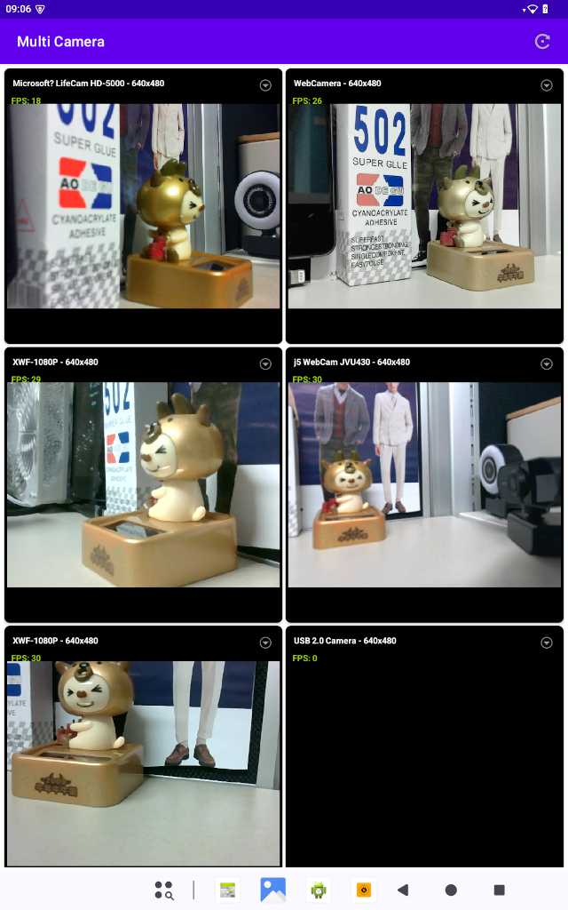

# MultiUVC Android Demo

A high-performance Android application demonstrating simultaneous previewing of multiple UVC (USB Video Class) cameras.

## Features

- **Multi-Camera Support**: Preview up to 6+ UVC cameras simultaneously (bandwidth permitting).
- **Sequential Initialization**: Robust sequential opening process to prevent USB permission conflicts and bandwidth spikes.
- **Dynamic Reordering**: Long-press and drag camera previews to customize your grid layout.
- **USB Hot-plug**: Real-time detection and automatic initialization of newly connected UVC devices.
- **High Performance**: Optimized for multi-camera setups using MJPEG format and smart bandwidth management (targeting 15 FPS per camera).
- **Smooth FPS Display**: Real-time FPS counter with EMA (Exponential Moving Average) smoothing for stable readings.
- **Interactive Menu**: Change resolutions, restart, or close individual camera streams on the fly.
- **Runtime Permissions**: Friendly handling of Android camera and USB permissions.

## Getting Started

### Prerequisites

- Android device with USB Host support.
- Multiple UVC-compatible cameras.
- A powered USB hub (highly recommended for multiple cameras).

### Installation

1. Clone the repository.
2. Open the project in Android Studio.
3. Build and run on your target device.

## Usage

- **Discovery**: Upon launch, the app scans for connected UVC cameras and starts them sequentially.
- **Refresh**: Use the refresh icon in the ActionBar to scan for newly plugged cameras.
- **Options**: Click the options button (⋮) on any camera preview to change resolution, restart the camera, or close the stream.
- **Reorder**: Long-press any preview to drag it to a new position in the grid.

## Architecture

- **`MultiCameraNewActivity`**: The main activity managing the lifecycle of multiple `CameraHelper` instances.
- **`CameraAdapter`**: RecyclerView adapter that manages the display of UVC previews using `AspectRatioSurfaceView`.
- **`CameraItem`**: Data structure representing each connected UVC camera.

## License

This project is licensed under the MIT License - see the [LICENSE](LICENSE) file for details.

## Author & Company

- **Company**: [Innocomm](https://www.innocomm.com/)
- **Lead Developer**: Mori Lin
