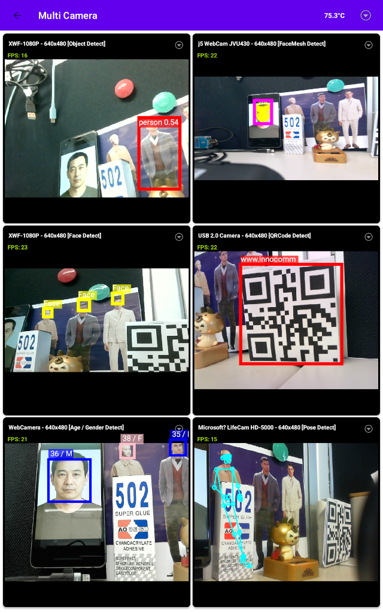

# MultiUVC Android Demo

  
  

A high-performance Android application demonstrating simultaneous previewing of multiple UVC (USB Video Class) cameras with real-time AI inference capabilities.

## Features

### Camera Management
- **Multi-Camera Support**: Preview up to 6+ UVC cameras simultaneously (bandwidth permitting).
- **Sequential Initialization**: Robust sequential opening process to prevent USB permission conflicts and bandwidth spikes.
- **Dynamic Reordering**: Long-press and drag camera previews to customize your grid layout.
- **USB Hot-plug**: Real-time detection and automatic initialization of newly connected UVC devices.
- **High Performance**: Optimized for multi-camera setups using MJPEG format and smart bandwidth management (targeting 15 FPS per camera).
- **Smooth FPS Display**: Real-time FPS counter with EMA (Exponential Moving Average) smoothing for stable readings.

### AI Detection
- **Comprehensive AI Suite**: Built-in support for:
    - **Object Detection**: Generic object detection using TensorFlow Lite.
    - **Face Detection**: Fast face detection using ML Kit.
    - **Face Mesh**: High-density 3D face landmarker.
    - **Pose Detection**: Real-time body pose estimation.
    - **Barcode/QR Code**: High-speed scanning for all barcode formats.
    - **Text Recognition**: Supporting Chinese/English text recognition.
    - **Age & Gender Estimation**: Simultaneous age and gender prediction with tracking-based optimization.
- **Per-Camera AI Engine**: Each camera can run a different AI model independently on its own background thread.
- **Resource Efficiency**: Heavy AI models are automatically released when views are recycled and restored when they come back into view.
- **AI Demo Mode**: One-click to randomly assign available AI models to all non-AI active cameras.

## Getting Started

### Prerequisites

- Android device with USB Host support.
- Multiple UVC-compatible cameras.
- A powered USB hub (highly recommended for multiple cameras).

### Installation

1. Clone the repository.
2. Open the project in Android Studio.
3. Build and run on your target device.

## Usage

- **Discovery**: Upon launch, the app scans for connected UVC cameras and starts them sequentially.
- **Refresh**: Use the refresh icon in the menu to scan for newly plugged cameras.
- **AI Demo**: Select "AI Demo" from the main menu to automatically assign random AI detectors to all idle camera previews.
- **Individual Options**: Click the options button (⋮) on any camera preview to:
    - Select specific **AI Detect** modes.
    - Change **Resolution**.
    - Restart or Close the stream.
- **Reorder**: Long-press any preview to drag it to a new position in the grid.

## Architecture

- **`MultiCameraNewActivity`**: The main activity managing the lifecycle of multiple `CameraHelper` instances and global AI demo logic.
- **`CameraAdapter`**: RecyclerView adapter that manages the display of UVC previews, background AI threads, and overlay rendering.
- **`AIManager`**: Singleton manager for shared AI detector instances and resource exclusivity.
- **`OverlayView`**: Custom view for high-performance canvas-based rendering of AI results.

## Third-Party Libraries & Licenses

This project utilizes the following third-party libraries:

- **[UVCAndroid](https://github.com/herohan/UVCAndroid)** (MIT License): Providing core UVC camera support and frame acquisition.
- **[TensorFlow Lite](https://www.tensorflow.org/lite)** (Apache License 2.0): Used for Object Detection and Age/Gender estimation.
- **[Google ML Kit](https://developers.google.com/ml-kit)**: Used for Face, Pose, Mesh, Barcode, and Text recognition.
- **[IndicatorSeekBar](https://github.com/warkiz/IndicatorSeekBar)** (Apache License 2.0): Used for UI components.
- **[XXPermissions](https://github.com/getActivity/XXPermissions)** (Apache License 2.0): Used for simplified runtime permission handling.

## License

This project is licensed under the MIT License - see the [LICENSE](LICENSE) file for details.

### ⚠️ 免責聲明 / Disclaimer

本應用程式僅供公司技術展示與效能壓力測試之用。其所提供的推論結果（特別是年齡與性別預測）可能存在誤差，不應作為產品質量保證或任何醫療、保全判定之依據。

---
---
**Developed by InnoComm Mobile Technology Corp. (Mori Lin)**  
© 2026 InnoComm Mobile Technology Corp.